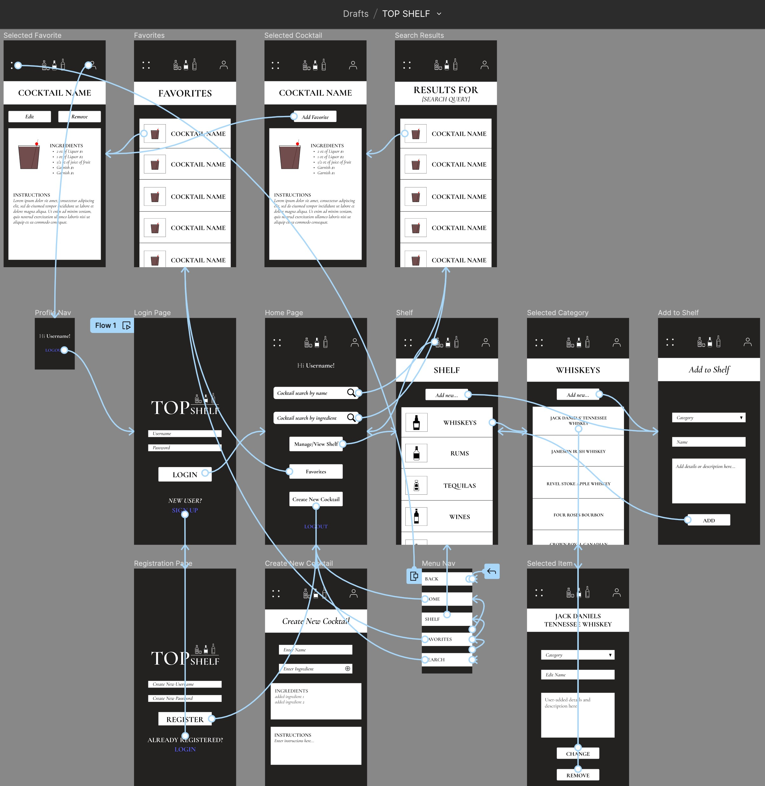

  

 

## 
  An easy to use application for searching, saving, editing, and creating cocktail recipes! 

### 
 ⭐ Check out [ HERE](https://topshelf-4e8e54ffbe62.herokuapp.com/#/home) ⭐ ! 

---

### 🗓️ _Duration: Three-Week-Sprint_

 This mobile-first application was built to make cocktail-making easy and accessible. 

 The search feature allows users to find cocktails by name or ingredient(s). When a user finds a recipe they like, they can save it for future reference. Saved cocktail recipes can also be customized to accommodate a user's specific tastes. Or, users can make their own recipes completely from scratch. 

---

# Design

Application flowcharting and wireframes were designed using Figma. Before ever writing a line of code, several days were spent on scoping TopShelf. Taking the time to parse through the data from the API, set up the database, design routes, and create each wireframe helped ensure that the application flowed logically. The goal was to have a final design that was user-friendly and consistently themed throughout.

--- 

# Prerequisites

Before you get started, make sure you have the following software installed on your computer:

- [Node.js](https://nodejs.org/en/)
- [PostrgeSQL](https://www.postgresql.org/)
- [Nodemon](https://nodemon.io/)

---

# Setup and Installation

- Create a database using the provided `database.sql` file, title the DB `top_shelf`
- Run the queries in the included `database.sql` file
- Run `npm install` from the project root directory
- Run `npm run server` to run the node server
- In a separate terminal tab, run `npm run client` to launch the React app

---

# Built with

[Visual Studio Code](https://code.visualstudio.com/)  
[Material UI](https://mui.com/)  
[Garamond Font](https://www.npmjs.com/package/@fontsource/eb-garamond)  
[TheCocktailDB API](https://www.thecocktaildb.com/)  
[Postico](https://eggerapps.at/postico/)  

---

# Application Use

- Users will first need to REGISTER using a username and password
- Once logged in, users will be navigated to the HOME PAGE
- From the HOME PAGE, users can search for a cocktail recipe by entering a name in the search bar, selecting the 'By Name' radio button, and clicking on the  button
- Users can also search by ingredient by selecting the 'By Ingredient' radio button and separating each entered ingredient by a comma
- Clicking on a cocktail reveals its full recipe details
- To save, select the  button
- Once saved, a cocktail can be edited, or even removed from the user's saved list

- Cocktails can also be created from scratch by selecting the  button on the HOME PAGE
- Created cocktails are then also added to the user's Saved list

 
 
 
 
 
 
 
 
 
 
 
 
 

---

# Acknowledgement

I would like to extend my deepest gratitude and appreciation to all the instructors, code-coaches, and to all of my cohortmates at [Prime Digital Academy](www.primeacademy.io)!
 

---